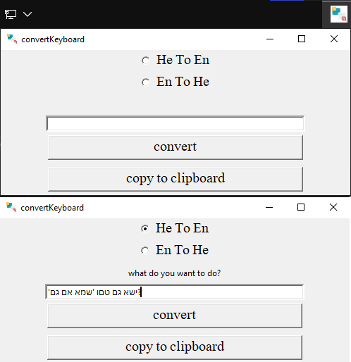

# Keyboard Character Converter

A simple Python GUI application built with Tkinter for converting keyboard characters between English and Hebrew layouts.

## Description

This Python application provides a graphical user interface (GUI) for converting keyboard characters between English and Hebrew layouts. It includes two conversion modes: "Hebrew to English" and "English to Hebrew." The conversion is based on predefined character dictionaries for each layout.

## Features

- Convert keyboard characters from Hebrew to English layout.
- Convert keyboard characters from English to Hebrew layout.
- Copy the conversion result to the clipboard.

## Installation

1. Make sure you have Python installed on your system.
2. Clone this repository to your local machine:
   ```sh
   git clone https://github.com/OrelAshush123/transportation_app.git

## Usage

1. Choose the conversion mode by selecting the radio button: "He to En" (Hebrew to English) or "En to He" (English to Hebrew).
2. Enter the text you want to convert in the text input field.
3. Click the "Convert" button to perform the conversion.
4. The converted result will be displayed below the text input.
5. Click the "Copy to Clipboard" button to copy the result to your clipboard.

## Example

Here's an example of the application in action:



## Credits
Developed by Orel Ashush
License
This project is licensed under the MIT License. See the [LICENSE](LICENSE) file for more information.
